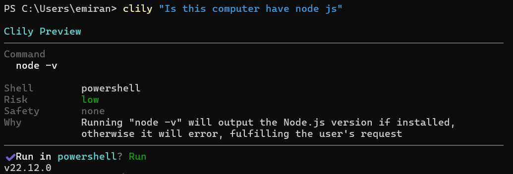
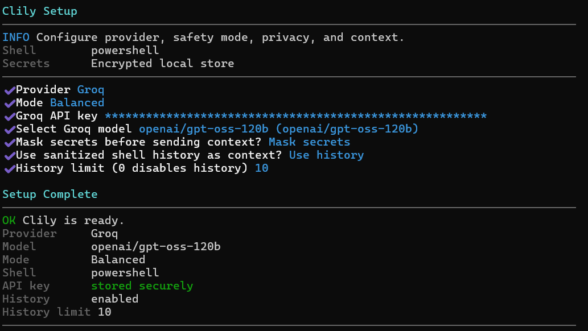
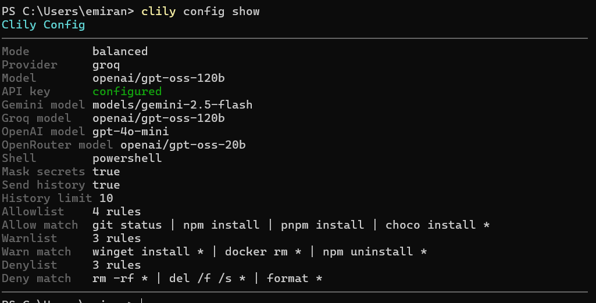

# Clily

[English](README.md) | Türkçe

`clily`, doğal dille yazdığın isteği tek bir shell komutuna dönüştürür, komutu yerel güvenlik kurallarından geçirir ve sonra çalıştırıp çalıştırmamayı sana bırakır.



NPM paket adı: `@emiran/clily`
CLI komutu: `clily`

## Neden Clily?

- Normal cümlelerle terminal komutu üretir
- Model ile terminal arasına yerel güvenlik katmanı koyar
- Komutu çalıştırmadan önce önizleme gösterir
- Son komut sonucu ve yerel geçmişi bağlam olarak kullanabilir
- Windows, macOS ve Linux'ta çalışır

## Özellikler

- Gemini, Groq, OpenAI ve OpenRouter provider desteği
- İnteraktif setup wizard
- Güvenlik modları: `safe`, `balanced`, `auto`
- Yerel `allowlist`, `warnlist`, `denylist`
- Güvenli yerel API key saklama
- CLI üzerinden config yönetimi
- `clily config doctor` ile config sağlık kontrolü
- Daha okunur terminal önizlemesi ve onay akışı

## Platform Desteği

- Windows: PowerShell ve CMD
- macOS: bash ve zsh
- Linux: bash ve zsh

Clily aktif shell'i algılar ve modele shell'e uygun komut istemeye çalışır.

## Kurulum

Gereksinim: Node.js `>=20.11.0`

```bash
npm install -g @emiran/clily
```

## Hızlı Başlangıç

İlk önce setup çalıştır:

```bash
clily --setup
```

İstersen setup'ı daha sonra tekrar şu komutla da açabilirsin:

```bash
clily setup
```



Sonra deneyebilirsin:

```bash
clily "git status göster"
clily "ruby kurulu mu"
clily "çalışan docker containerlarını listele"
```

Yerel kurallar izin veriyorsa doğrudan çalıştırmayı da kullanabilirsin:

```bash
clily "node sürümünü göster" --run
```

`--run`, güvenlik modun izin veriyorsa üretilen komutu çalıştırır.

## Nasıl Çalışır?

1. Doğal dilde isteğini yazarsın.
2. Clily seçili modele tek bir shell komutu ürettirir.
3. Üretilen komut yerel güvenlik kurallarından geçer.
4. Komut, risk ve gerekçe ile birlikte önizleme gösterilir.
5. Moduna göre onay ister veya komutu doğrudan çalıştırır.

## Güvenlik Modeli

Clily üç yerel kural grubu kullanır:

- `allowlist`: güvenilen komutlar
- `warnlist`: onay istemesi gereken komutlar
- `denylist`: engellenmesi gereken komutlar

Güvenlik modları:

- `safe`: her zaman sor
- `balanced`: güvenilenleri otomatik çalıştır, diğerlerini sor
- `auto`: yerel bir kural engellemedikçe onay istemeden çalıştır

Örnek kural yönetimi:

```bash
clily safety allow list
clily safety allow add "git status"
clily safety warn add "docker rm *"
clily safety deny add "rm -rf *"
```

## Konfigürasyon

Yararlı komutlar:

```bash
clily config show
clily config path
clily config doctor
clily config set mode auto
clily config set provider.name groq
clily config set provider.model openai/gpt-oss-20b
clily config set provider.apiKey YOUR_KEY
```

`clily config doctor`, kurulum, config ve API key ile ilgili yaygın sorunları kontrol eder.



## Gizlilik ve Secret Storage

- secret benzeri değerler modele gitmeden önce maskelenebilir
- shell history açılabilir, sınırlanabilir veya kapatılabilir
- son komut sonucu yerel bağlam olarak tekrar kullanılabilir

## Provider'lar

### Gemini

- setup sırasında model seçimi yapılabilir

### Groq

- şu an en iyi sonuç genelde `openai/gpt-oss-20b` ve `openai/gpt-oss-120b` ile alınır

### OpenAI

- varsayılan olarak `gpt-4o-mini` ile gelir

### OpenRouter

- setup sırasında model seçimi yapılabilir

## Dokümanlar

- [English README](README.md)
- [Contributing Guide](CONTRIBUTING.md)

## Geliştirme

Lokal geliştirme için:

```bash
npm install
npm run check
npm run build
npm run test
npm run dev -- --setup
```

Paket ön kontrolü:

```bash
npm pack
```

## Katkı

Issue ve pull request açabilirsin.

- bug ve feature request için GitHub Issues kullan
- kod katkısı için pull request aç
- PR açmadan önce şunları çalıştır:

```bash
npm run check
npm run build
npm run test
```

Daha fazla bilgi: [CONTRIBUTING.md](CONTRIBUTING.md)

## Destek

Bir şey yanlış veya kafa karıştırıcı görünüyorsa:

- bug veya beklenmeyen davranış için issue aç
- döküman veya setup problemi için issue aç
- mümkünse platform, shell, provider ve çalıştırdığın komutu ekle

## Lisans

[MIT](LICENSE)
